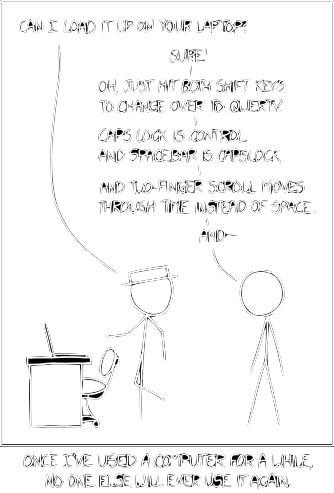

# Dennis's dotfiles

This is the GitHub-hosted website for my dotfiles.

Check out the [wiki](https://github.com/dnnsmnstrr/dotfiles/wiki) or [HydroTouch](https://github.com/dnnsmnstrr/dotfiles/tree/master/bettertouchtool/HydroTouch)

If for some reason you want to install my stuff, follow the [TODO](TODO.md)

xkcd ([#1806](https://xkcd.com/1806/))

[<- Back to Homepage](https://dnnsmnstrr.github.io)
